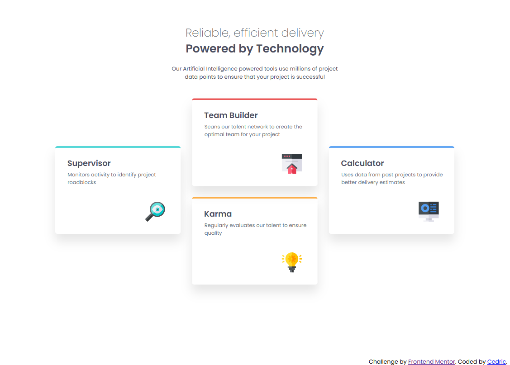
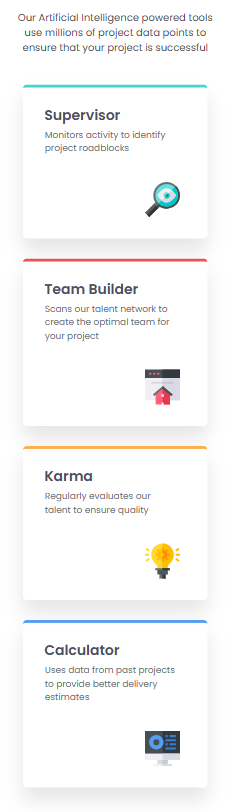

# Frontend Mentor - Four Card Feature Section Solution

This is a solution to the [Four Card Feature Section Challenge on Frontend Mentor](https://www.frontendmentor.io/challenges/four-card-feature-section-weK1eFYK). Frontend Mentor challenges help you improve your coding skills by building realistic projects.

---

## Table of Contents

- [Overview](#overview)
  - [The Challenge](#the-challenge)
  - [Screenshot](#screenshot)
  - [Links](#links)
- [My Process](#my-process)
  - [Built With](#built-with)
  - [What I Learned](#what-i-learned)
  - [Continued Development](#continued-development)
  - [Useful Resources](#useful-resources)
- [Author](#author)
- [Acknowledgments](#acknowledgments)

---

## Overview

- This project showcases a **responsive four-card feature layout** that adapts beautifully across mobile and desktop screens. Each card highlights a specific feature, arranged using CSS Grid for balanced spacing and visual harmony.

### The Challenge

Users should be able to:

- View the optimal layout for the site depending on their device’s screen size.

### Screenshot

  


### Links

- **Solution URL:** [Add solution URL here](https://your-solution-url.com)  
- **Live Site URL:** [Add live site URL here](https://your-live-site-url.com)

---

## My Process

### Built With

- Semantic HTML5 markup  
- CSS custom properties  
- Flexbox  
- CSS Grid  
- Mobile-first workflow  

---

### What I Learned

While working on this project, I learned how to effectively use **CSS Grid** to properly align elements and create balanced layouts.  
It helped me understand how grid rows, columns, and gaps can be adjusted to achieve a clean and organized design across different screen sizes.

Here’s an example of a code snippet I used:

```css
display: grid;
grid-template-columns: repeat(3, 1fr);
grid-template-rows: repeat(3, auto);
margin: auto auto;
gap: 2em;
max-width: 70rem;
justify-self: center;
align-items: center;
position: relative;
padding-bottom: 3em;
```

This setup made it easier to arrange the cards symmetrically and ensure consistent spacing.

---

### Continued Development

In future projects, I want to:

- Improve my understanding of **responsive grid layouts**  
- Explore how to combine **Flexbox and Grid** effectively  
- Practice more advanced **CSS positioning** and **alignment** techniques  

---

### Useful Resources

- [freeCodeCamp](https://www.freecodecamp.org) – Helped me understand the fundamentals of CSS Grid and responsive layout techniques.  

---

## Author

- **Website** – [Cedric Celestino](https://github.com/Cedric-Celestino)  
- **Frontend Mentor** – [@Cedric-Celestino](https://www.frontendmentor.io/profile/Cedric-Celestino)

---

## Acknowledgments

Special thanks to **Frontend Mentor** for providing this project and to the **freeCodeCamp** community for their excellent lessons on CSS layout design.
